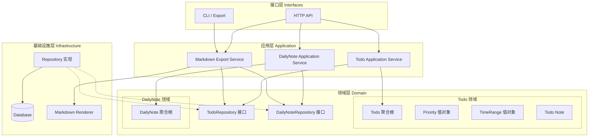

# TodoList 后端服务

## 概述

一个基于 DDD（领域驱动设计）架构的待办事项后端服务，提供以下功能：

- 创建待办事项（Todo）
- 设置预计时间/执行时间段、实际时间
- 支持优先级设置
- 添加备注和笔记
- 每日笔记书写
- Markdown 格式导出

## 技术栈

- **语言**：Go 1.25.5
- **Web框架**：net/http
- **数据库**：MySQL
- **架构模式**：DDD（领域驱动设计）
- **容器化**：Docker
- **CI/CD**：GitHub Actions

## 项目结构

```text
todo-service/
├── cmd/
│   └── server/
│       └── main.go              # 程序入口
│
├── internal/
│   ├── interfaces/              # 接口层（Adapter）
│   │   ├── http/
│   │   │   ├── handler/
│   │   │   │   ├── todo_handler.go
│   │   │   │   └── daily_note_handler.go
│   │   │   └── router.go
│   │   └── dto/
│   │       ├── todo_dto.go
│   │       └── daily_note_dto.go
│   │
│   ├── application/             # 应用层（Use Case）
│   │   ├── todo/
│   │   │   ├── create_todo.go
│   │   │   ├── complete_todo.go
│   │   │   ├── update_time.go
│   │   │   └── add_note.go
│   │   ├── daily_note/
│   │   │   ├── write_daily_note.go
│   │   │   └── get_daily_note.go
│   │   └── export/
│   │       └── markdown_export.go
│   │
│   ├── domain/                  # 领域层（核心）
│   │   ├── todo/
│   │   │   ├── todo.go           # 聚合根
│   │   │   ├── note.go
│   │   │   ├── priority.go       # 值对象
│   │   │   ├── time_range.go     # 值对象
│   │   │   └── repository.go     # TodoRepository 接口
│   │   ├── daily_note/
│   │   │   ├── daily_note.go
│   │   │   └── repository.go
│   │   └── common/
│   │       ├── id.go
│   │       └── time.go
│   │
│   ├── infrastructure/          # 基础设施层
│   │   ├── persistence/
│   │   │   ├── mysql/
│   │   │   │   ├── todo_repo.go
│   │   │   │   └── daily_note_repo.go
│   │   │   └── migrations/
│   │   ├── markdown/
│   │   │   └── renderer.go
│   │   └── config/
│   │       └── config.go
│   │
│   └── bootstrap/
│       └── wire.go               # 依赖注入
│
├── docs/
│   ├── architecture.md
│   └── api.md
│
├── .github/
│   └── workflows/
│       └── ci-cd.yml
│
├── go.mod
├── go.sum
├── Dockerfile
├── docker-compose.yml
└── README.md
```

## 架构图



## 分层说明

| 目录 | 层次 | 职责 | 依赖方向 |
| --- | --- | --- | --- |
| `internal/interfaces` | 接口层 | 处理 HTTP 请求/响应，参数验证，路由 | → 应用层 |
| `internal/application` | 应用层 | 编排业务流程，用例实现（Todo、DailyNote、Export） | → 领域层 |
| `internal/domain` | 领域层 | 核心业务逻辑，聚合根，值对象，仓储接口 | 无依赖 |
| `internal/infrastructure` | 基础设施层 | 数据持久化，外部服务对接，配置管理 | → 领域层 |
| `internal/bootstrap` | 启动层 | 依赖注入，应用初始化 | → 所有层 |

## 快速开始

### 环境要求

- Go 1.25.5+
- MySQL 8.0+

### 安装

```bash
# 克隆项目
git clone <repository-url>

# 安装依赖
go mod download
```

### 运行

```bash
# 启动服务
go run cmd/server/main.go

# 或构建后运行
go build -o bin/server cmd/server/main.go
./bin/server
```

## API 端点（规划中）

| 方法 | 路径 | 描述 |
| --- | --- | --- |
| POST | /api/todos | 创建待办事项 |
| GET | /api/todos | 获取待办列表 |
| GET | /api/todos/:id | 获取单个待办 |
| PUT | /api/todos/:id | 更新待办事项 |
| DELETE | /api/todos/:id | 删除待办事项 |
| GET | /api/todos/export | 导出 Markdown |

## Docker 部署

### 构建镜像

```bash
# 构建镜像
docker build -t todolist:latest .

# 或使用多阶段构建优化镜像大小
docker build -f Dockerfile.prod -t todolist:latest .
```

### 运行容器

```bash
# 使用 Docker Compose（推荐）
docker-compose up -d

# 或单独运行
docker run -d \
  --name todolist \
  -p 8080:8080 \
  -e DB_HOST=mysql \
  -e DB_PORT=3306 \
  -e DB_NAME=todolist \
  -e DB_USER=root \
  -e DB_PASSWORD=password \
  todolist:latest
```

### 环境变量

| 变量名 | 说明 | 默认值 |
| --- | --- | --- |
| `SERVER_PORT` | 服务端口 | 8080 |
| `DB_HOST` | 数据库主机 | localhost |
| `DB_PORT` | 数据库端口 | 3306 |
| `DB_NAME` | 数据库名称 | todolist |
| `DB_USER` | 数据库用户 | root |
| `DB_PASSWORD` | 数据库密码 | - |
| `GIN_MODE` | 运行模式 | release |

## CI/CD

### GitHub Actions 工作流

项目使用 GitHub Actions 实现自动化构建和部署：

```yaml
# .github/workflows/ci-cd.yml
name: CI/CD Pipeline

on:
  push:
    branches: [ main, develop ]
  pull_request:
    branches: [ main ]

jobs:
  test:
    runs-on: ubuntu-latest
    steps:
      - uses: actions/checkout@v4
      - name: Set up Go
        uses: actions/setup-go@v5
        with:
          go-version: '1.25.5'
      - name: Run tests
        run: |
          go test -v ./...
          go vet ./...

  build:
    needs: test
    runs-on: ubuntu-latest
    if: github.ref == 'refs/heads/main'
    steps:
      - uses: actions/checkout@v4
      - name: Set up Docker Buildx
        uses: docker/setup-buildx-action@v3
      - name: Login to Docker Hub
        uses: docker/login-action@v3
        with:
          username: ${{ secrets.DOCKER_USERNAME }}
          password: ${{ secrets.DOCKER_PASSWORD }}
      - name: Build and push
        uses: docker/build-push-action@v5
        with:
          context: .
          push: true
          tags: |
            ${{ secrets.DOCKER_USERNAME }}/todolist:latest
            ${{ secrets.DOCKER_USERNAME }}/todolist:${{ github.sha }}
          cache-from: type=gha
          cache-to: type=gha,mode=max

  deploy:
    needs: build
    runs-on: ubuntu-latest
    if: github.ref == 'refs/heads/main'
    steps:
      - name: Deploy to server
        uses: appleboy/ssh-action@v1.0.0
        with:
          host: ${{ secrets.SERVER_HOST }}
          username: ${{ secrets.SERVER_USER }}
          key: ${{ secrets.SSH_PRIVATE_KEY }}
          script: |
            docker pull ${{ secrets.DOCKER_USERNAME }}/todolist:latest
            docker stop todolist || true
            docker rm todolist || true
            docker run -d --name todolist -p 8080:8080 ${{ secrets.DOCKER_USERNAME }}/todolist:latest
```

### 配置 Secrets

在 GitHub 仓库设置中添加以下 Secrets：

| Secret 名称 | 说明 |
| --- | --- |
| `DOCKER_USERNAME` | Docker Hub 用户名 |
| `DOCKER_PASSWORD` | Docker Hub 密码/Token |
| `SERVER_HOST` | 部署服务器地址 |
| `SERVER_USER` | 服务器用户名 |
| `SSH_PRIVATE_KEY` | SSH 私钥 |

## 开发状态

### 后端开发

- [ ] 领域模型设计
- [ ] 仓储接口定义
- [ ] 应用服务实现
- [ ] HTTP 接口开发
- [ ] 数据库集成
- [ ] 单元测试
- [ ] API 文档

### DevOps

- [ ] Dockerfile 编写
- [ ] Docker Compose 配置
- [ ] GitHub Actions 工作流
- [ ] CI/CD Pipeline 调试
- [ ] 生产环境部署配置
