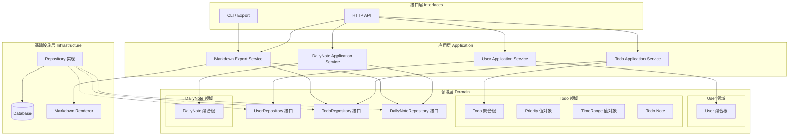

# TodoList 后端服务

## 概述

一个基于 DDD（领域驱动设计）架构的待办事项后端服务，提供以下功能：

- **用户管理**：用户注册、登录、认证
- **待办事项管理**：创建待办事项、设置预计时间/执行时间段、实际时间
- **优先级设置**：支持 low/medium/high 三种优先级
- **备注功能**：为待办事项添加多条备注
- **每日笔记**：每日笔记书写和管理
- **Markdown 导出**：支持导出为 Markdown 格式

## 技术栈

- **语言**：Go 1.25.5
- **Web框架**：net/http
- **数据库**：MySQL 8.0+
- **数据库驱动**：sqlx + go-sql-driver/mysql
- **配置管理**：Viper
- **认证授权**：JWT (golang-jwt/jwt/v5)
- **密码加密**：bcrypt (golang.org/x/crypto)
- **架构模式**：DDD（领域驱动设计）
- **日志**：自定义 logger 组件
- **容器化**：Docker
- **CI/CD**：GitHub Actions

## 项目结构

```text
todo-service/
├── cmd/
│   └── server/
│       └── main.go              # 程序入口
│
├── internal/
│   ├── interfaces/              # 接口层（Adapter）
│   │   ├── http/
│   │   │   ├── handler/         # HTTP 处理器
│   │   │   ├── request/         # 请求 DTO
│   │   │   └── response/        # 响应 DTO
│   │   └── do/                  # 数据对象（Data Object）
│   │       ├── user.go
│   │       ├── daily_note.go
│   │       ├── todo.go
│   │       └── note.go
│   │
│   ├── domain/                  # 领域层（核心）
│   │   ├── user/                # 用户领域
│   │   │   ├── entity.go        # 用户实体
│   │   │   ├── value_objects.go # 值对象（Email, Password, Role）
│   │   │   ├── errors.go        # 领域错误
│   │   │   ├── repository.go    # 仓储接口
│   │   │   ├── service.go       # 领域服务
│   │   │   └── hasher.go        # 密码哈希接口
│   │   ├── todo/                # 待办事项领域
│   │   ├── daily_note/          # 每日笔记领域
│   │   └── common/              # 通用领域概念
│   │
│   ├── infrastructure/          # 基础设施层
│   │   ├── persistence/         # 数据持久化
│   │   │   └── mysql/
│   │   │       ├── db.go        # 数据库连接
│   │   │       └── user_repository.go  # 用户仓储实现
│   │   ├── config/              # 配置管理
│   │   │   ├── db_config.go     # 数据库配置
│   │   │   └── jwt_config.go    # JWT 配置
│   │   └── hasher/              # 密码哈希实现
│   │
│   └── pkg/                     # 内部包
│       ├── logger/              # 日志组件
│       └── auth/                # 认证工具
│           ├── hasher.go        # bcrypt 哈希实现
│           └── token.go         # JWT Token 工具
│
├── docs/
│   ├── architecture.md
│   └── api.md
│
├── .github/
│   └── workflows/
│       └── ci-cd.yml
│
├── go.mod
├── go.sum
├── Dockerfile
├── docker-compose.yml
└── README.md
```

## 架构图



## 分层说明

| 目录 | 层次 | 职责 | 依赖方向 |
| --- | --- | --- | --- |
| `internal/interfaces` | 接口层 | 处理 HTTP 请求/响应，参数验证，路由 | → 应用层 |
| `internal/application` | 应用层 | 编排业务流程，用例实现（Todo、DailyNote、Export） | → 领域层 |
| `internal/domain` | 领域层 | 核心业务逻辑，聚合根，值对象，仓储接口 | 无依赖 |
| `internal/infrastructure` | 基础设施层 | 数据持久化，外部服务对接，配置管理 | → 领域层 |
| `internal/bootstrap` | 启动层 | 依赖注入，应用初始化 | → 所有层 |

## 快速开始

### 环境要求

- Go 1.25.5+
- MySQL 8.0+

### 安装

```bash
# 克隆项目
git clone <repository-url>

# 安装依赖
go mod download
```

### 运行

```bash
# 启动服务
go run cmd/server/main.go

# 或构建后运行
go build -o bin/server cmd/server/main.go
./bin/server
```

## API 端点

### 健康检查

| 方法 | 路径 | 描述 |
| --- | --- | --- |
| GET | /health | 健康检查 |

### 用户管理

| 方法 | 路径 | 描述 |
| --- | --- | --- |
| POST | /api/users/register | 用户注册 |
| POST | /api/users/login | 用户登录 |
| GET | /api/users/profile | 获取用户信息 |
| PUT | /api/users/profile | 更新用户信息 |

### 待办事项

| 方法 | 路径 | 描述 |
| --- | --- | --- |
| POST | /api/todos | 创建待办事项 |
| GET | /api/todos | 获取待办列表 |
| GET | /api/todos/:id | 获取单个待办 |
| PUT | /api/todos/:id | 更新待办事项 |
| DELETE | /api/todos/:id | 删除待办事项 |
| POST | /api/todos/:id/notes | 添加备注 |
| GET | /api/todos/:id/notes | 获取备注列表 |

### 每日笔记

| 方法 | 路径 | 描述 |
| --- | --- | --- |
| POST | /api/daily-notes | 创建每日笔记 |
| GET | /api/daily-notes | 获取每日笔记列表 |
| GET | /api/daily-notes/:id | 获取单个笔记 |
| PUT | /api/daily-notes/:id | 更新每日笔记 |
| DELETE | /api/daily-notes/:id | 删除每日笔记 |
| GET | /api/daily-notes/:date | 根据日期获取笔记 |

### 导出

| 方法 | 路径 | 描述 |
| --- | --- | --- |
| GET | /api/export/daily-notes/:id | 导出每日笔记为 Markdown |
| GET | /api/export/todos/:id | 导出待办事项为 Markdown |

## 认证机制

### JWT 认证流程

项目使用 JWT（JSON Web Token）实现用户认证：

```text
用户登录 → 验证密码 → 生成 JWT Token → 返回 Token
        ↓
后续请求携带 Token → 解析验证 → 获取用户信息 → 执行业务逻辑
```

### Token 结构

```go
type CustomClaims struct {
    jwt.RegisteredClaims  // 标准字段（exp, iat, 等）
    UserID   int64  `json:"user_id"`
    Username string `json:"username"`
    Role     string `json:"role"`
}
```

### 密码加密

使用 bcrypt 算法进行密码哈希：

- **Hasher 接口**：定义在领域层（[domain/user/hasher.go](internal/domain/user/hasher.go)）
- **bcrypt 实现**：提供在基础设施层（[pkg/auth/hasher.go](internal/pkg/auth/hasher.go)）
- 默认 cost factor：10

### 依赖注入

使用单例模式获取 TokenTool 实例：

```go
tokenTool := auth.GetTokenTool()
token, err := tokenTool.GenerateToken(userID, username, role)
```

## Docker 部署

### 构建镜像

```bash
# 构建镜像
docker build -t todolist:latest .

# 或使用多阶段构建优化镜像大小
docker build -f Dockerfile.prod -t todolist:latest .
```

### 运行容器

```bash
# 使用 Docker Compose（推荐）
docker-compose up -d

# 或单独运行
docker run -d \
  --name todolist \
  -p 8080:8080 \
  -e DB_HOST=mysql \
  -e DB_PORT=3306 \
  -e DB_NAME=todolist \
  -e DB_USER=root \
  -e DB_PASSWORD=password \
  todolist:latest
```

### 环境变量

| 变量名 | 说明 | 默认值 |
| --- | --- | --- |
| `SERVER_PORT` | 服务端口 | 8080 |
| `DB_HOST` | 数据库主机 | localhost |
| `DB_PORT` | 数据库端口 | 3306 |
| `DB_NAME` | 数据库名称 | todolist |
| `DB_USER` | 数据库用户 | root |
| `DB_PASSWORD` | 数据库密码 | - |
| `GIN_MODE` | 运行模式 | release |

## CI/CD

### GitHub Actions 工作流

项目使用 GitHub Actions 实现自动化构建和部署：

```yaml
# .github/workflows/ci-cd.yml
name: CI/CD Pipeline

on:
  push:
    branches: [ main, develop ]
  pull_request:
    branches: [ main ]

jobs:
  test:
    runs-on: ubuntu-latest
    steps:
      - uses: actions/checkout@v4
      - name: Set up Go
        uses: actions/setup-go@v5
        with:
          go-version: '1.25.5'
      - name: Run tests
        run: |
          go test -v ./...
          go vet ./...

  build:
    needs: test
    runs-on: ubuntu-latest
    if: github.ref == 'refs/heads/main'
    steps:
      - uses: actions/checkout@v4
      - name: Set up Docker Buildx
        uses: docker/setup-buildx-action@v3
      - name: Login to Docker Hub
        uses: docker/login-action@v3
        with:
          username: ${{ secrets.DOCKER_USERNAME }}
          password: ${{ secrets.DOCKER_PASSWORD }}
      - name: Build and push
        uses: docker/build-push-action@v5
        with:
          context: .
          push: true
          tags: |
            ${{ secrets.DOCKER_USERNAME }}/todolist:latest
            ${{ secrets.DOCKER_USERNAME }}/todolist:${{ github.sha }}
          cache-from: type=gha
          cache-to: type=gha,mode=max

  deploy:
    needs: build
    runs-on: ubuntu-latest
    if: github.ref == 'refs/heads/main'
    steps:
      - name: Deploy to server
        uses: appleboy/ssh-action@v1.0.0
        with:
          host: ${{ secrets.SERVER_HOST }}
          username: ${{ secrets.SERVER_USER }}
          key: ${{ secrets.SSH_PRIVATE_KEY }}
          script: |
            docker pull ${{ secrets.DOCKER_USERNAME }}/todolist:latest
            docker stop todolist || true
            docker rm todolist || true
            docker run -d --name todolist -p 8080:8080 ${{ secrets.DOCKER_USERNAME }}/todolist:latest
```

### 配置 Secrets

在 GitHub 仓库设置中添加以下 Secrets：

| Secret 名称 | 说明 |
| --- | --- |
| `DOCKER_USERNAME` | Docker Hub 用户名 |
| `DOCKER_PASSWORD` | Docker Hub 密码/Token |
| `SERVER_HOST` | 部署服务器地址 |
| `SERVER_USER` | 服务器用户名 |
| `SSH_PRIVATE_KEY` | SSH 私钥 |

## 开发状态

### 后端开发

- [x] 项目结构搭建
- [x] HTTP 基础框架
- [x] 健康检查接口
- [x] 数据模型设计（DO）
- [x] ER 图设计
- [x] 日志组件（logger）
- [x] 用户领域模型实现
  - [x] 用户实体（Entity）
  - [x] 值对象（Email, Password, Role）
  - [x] 领域错误定义
  - [x] 领域服务（UserDomainService）
- [x] 用户仓储接口和实现
- [x] 密码哈希（bcrypt）
- [x] JWT Token 工具
- [x] 数据库配置和连接
- [x] 用户 HTTP Handler
- [ ] 待办事项领域模型
- [ ] 每日笔记领域模型
- [ ] 应用服务层（Application）
- [ ] 完整的业务接口开发
- [ ] 单元测试
- [ ] API 文档

### DevOps

- [ ] Dockerfile 编写
- [ ] Docker Compose 配置
- [ ] GitHub Actions 工作流
- [ ] CI/CD Pipeline 调试
- [ ] 生产环境部署配置

## 数据库设计

### ER 图

项目包含以下核心实体：

- **用户（users）**：用户账户信息
- **每日笔记（daily_notes）**：用户的每日笔记
- **待办事项（todos）**：关联到每日笔记的待办事项
- **备注（notes）**：待办事项的备注信息

数据层级关系：用户 → 每日笔记 → 待办事项 → 备注

详细的 ER 图请参考：[docs/arch/er.puml](docs/arch/er.puml)
